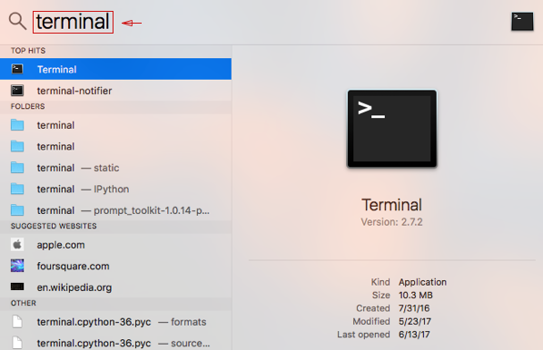
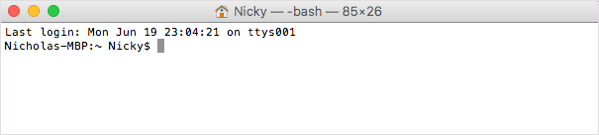
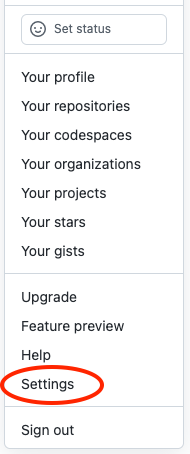
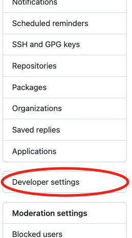
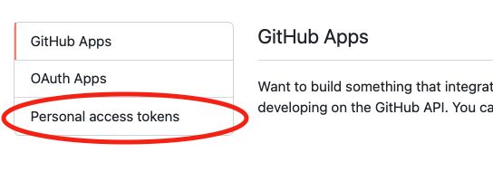
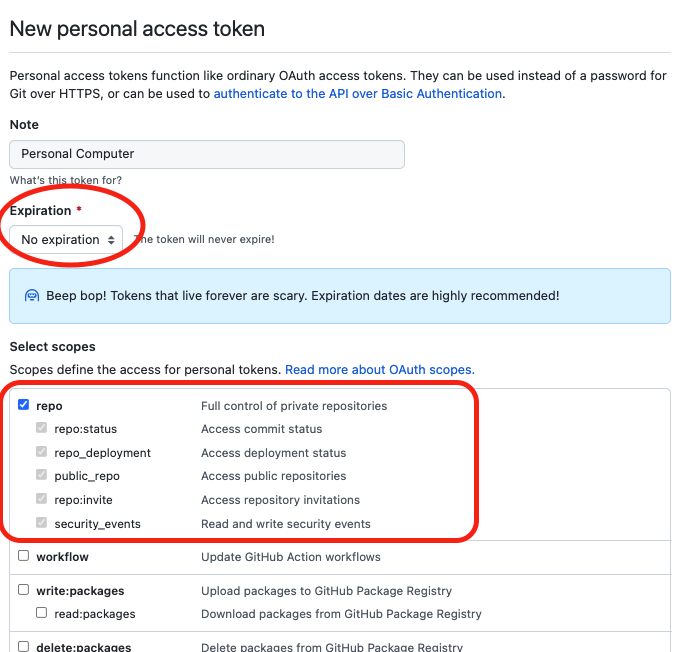
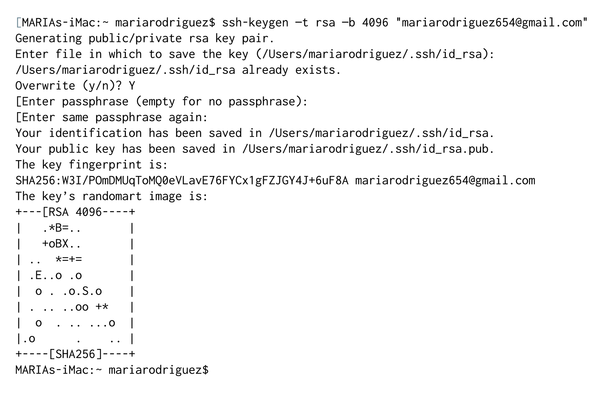
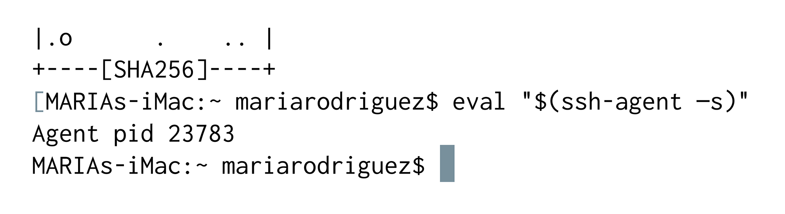

### DU Class Notes Table of Contents

----------------------------------------------

-   [Course Overview](README.md)
-   [Tool Setup](1_DU_tool_setup.md)
    -   [Tool Setup - Mac](1.1_DU_tool_setup_mac.md)
    -   [Tool Setup - Windows](1.2_DU_tool_setup_windows.md)
        -   [Windows - alternate setup using wsl](1.2.1_DU_windows_alternate_install_using_wsl.md)
        -   [Tool Setup - Windows WSL](1.2.2_DU_tool_setup_wsl.md)
-   [Online Research Tips](2_online_research_tips.md)
-   [Further Reading and Helpful Links](3_further_reading_and_helpful_links.md)
    -   [Cheatsheets & Tips](3.1_cheatsheets_and_tips.md)
        -   [Scientific python cheatsheet by IPGD](3.1.1_scientific_python_cheat_sheet_by_IPGP.md)
        -   [Useful Python tips](3.1.2_useful_python.md)
    -   [Books](3.2_books.md)
    -   [Articles](3.3_articles.md)
    -   [Subscriptions](3.4_subscriptions)
-   [Career Engagement](4_career_engagement.md)

----------------------------------------------


# 2.1.3: Install Your Tools on Mac: Pre-Work: DU-VIRT-AI-PT-02-2024-U-LOLC

> ## Excerpt
> Now it's time to collect your tools and begin. This page includes the setup guides for Mac, if you are on a Windows device please click next at the bottom of the page to see the Windows instructions. Follow the instructions closely and do your best with the information you have. (Yes, we know there is a lot to install.)

---
Now it's time to collect your tools and begin. This page includes the setup guides for Mac, if you are on a Windows device please click next at the bottom of the page to see the Windows instructions. Follow the instructions closely and do your best with the information you have. (Yes, we know there is a lot to install.)

### Before You Begin

First, create accounts for the following services, which you'll need throughout the course. Don't just create logins; job recruiters often scour these sites in search of job candidates, so be sure to provide at least a headshot and contact information.

-   [LinkedIn Links to an external site.](https://www.linkedin.com/)

**note**

You should create a full profile highlighting your skills and work experience, and include a headshot.

-   [GitHub Links to an external site.](https://github.com/)
-   [Stack Overflow Links to an external site.](http://stackoverflow.com/)

In addition, be sure to accept the invite for your section on [Slack Links to an external site.](https://slack.com/). You will receive the link to your class-specific channel near the start of your first class.

## Tool and Software Installations

Follow the instructions below to complete the installation process for all of the required tools.

## Google Chrome

1.  If you don’t already have Chrome installed, visit the [download page Links to an external site.](https://www.google.com/chrome/browser/desktop/index.html).
2.  Download, open, and run the installation file.

## Slack

1.  Search for Slack in the App Store. Click Get under the app name and icon, and then click Install.
    
2.  When the installation is complete, add our channel to your application.
    
3.  Click the header of your current Slack channel.
    
4.  Select "Sign in to another team."
    
5.  Enter the Slack domain provided to you near the start of your first class.
    
    
    
6.  Enter your email (the one that the Slack invite was sent to) and password.
    

## Xcode

Xcode is a development suite exclusive to Mac. We will primarily be using Visual Studio Code in this course, but installing Xcode will set up some of the other required boot-camp programs including Git, which coders depend on for logging the development of programs and applications.

To install, open up the App Store on your Mac and search for Xcode, then click "Get".

## Terminal

You’ll enter your command line code through this interface. Since you’re on a Mac right now, you already have it! Just follow these steps to open the program.

1.  Press command+space bar to open Spotlight Search.
    
2.  Type "terminal" into the search and then press Enter.
    
    
    
3.  Keep this window open; you’ll need it for the next steps.
    
    
    

## GitHub Token Setup Guide

To complete the following steps, you'll need to sign up for an account on the [GitHub website Links to an external site.](https://github.com/) if you haven't already.

1.  Click your profile image in the top-right corner of the GitHub website, and choose Settings from the dropdown menu.
    
    
    
2.  Scroll down and select "Developer settings" on the left, as shown in the following image:
    
    
    
3.  Then click "Personal access tokens" from the left, as shown in the following image:
    
    
    
4.  Click "Generate new token" in the upper right, configure for "No expiration," and check the "repo" box for full control of private repositories, to match the following image:
    
    
    
5.  After generating the token, leave the page open. You will need to use the token for authentication in a later step.
    

Next, follow these steps in your command line:

1.  Enter the following code with your GitHub username, then hit Enter to set your git username.

```
   git config --global user.name &lt;your_username&gt;
```

2\. Next, enter `git config --global user.password <your_token>` using your personal access token from the GitHub window left open in the previous step in place of a password, then hit Enter.

Nice work! You have now completed the Token Setup. As you will learn, GitHub is a collaborative tool—you can pull any changes down to your local repository quickly and easily, allowing you to easily share different versions of your code across workstations and to easily checkout and test those versions on your local computer.

## GitLab SSH Key Setup Guide

In order to use GitLab to access course materials, you will need to complete the following steps to setup an SSH key. Before beginning these steps, make sure you have access to your class GitLab account. You will receive an email with an invitation to your GitLab course page a week before the course start date. If you're following these instructions more than a week before the course start date, you'll need to return to this task once you receive the email invitation. If it is less than a week prior to the course start date and you haven't seen this email yet, please check your "Spam" folder first. In case it's not there, don't hesitate to contact your Student Success Advisor (SSA) to secure your access. Once you have access to your account, you can proceed with the SSH key setup.

1.  Open Terminal.
    
2.  To make sure you don’t already have a set of keys on your computer, type the following in your Terminal window.
    
    **Note:** Copying and pasting will not work!
    
     `ls –al ~/.ssh`
    
    -   If no keys pop up, move on to Step 3.
    -   If keys do pop up, check that none of them are listed under `id_rsa`, like in this image:
    
    
    
    -   If you find a key named id\_rsa, you may either overwrite it by following the subsequent steps or use your existing key, which will be referenced in Step 8. If you choose not to overwrite it, remember the password associated with your key.
3.  Enter the following command along with your email to generate your keys.
    
    `ssh-keygen –t rsa –b 4096 –C "YOURGITLABEMAIL@PLACEHOLDER.NET"`
    
4.  When prompted to enter a file to save the key, press Enter, and then enter a passphrase for your key.
    
    **Note:** You shouldn’t see any characters appear in the window while typing the password.
    
    When you’re finished, your window should look like this:
    
    
    
5.  Link your key to your machine using a tool called the ssh-agent. Run the following command to test whether the ssh-agent is running on your machine: `eval "$(ssh-agent –s)"`. Your Terminal window should look like this:
    
    
    
6.  Run the following command: `ssh-add ~/.ssh/id_rsa`.
    
7.  When prompted, enter the passphrase associated with the key.
    
    **Note:** If you’ve forgotten this key, go back to Step 3.
    
8.  To add the key to Git, copy the key to your clipboard by entering the following command:
    
    `pbcopy < ~/.ssh/id_rsa.pub`
    

-   You shouldn’t see any kind of message when you run this command. If you do, make sure you entered it correctly.
    
    **Note:** Do not copy anything else to your clipboard until all steps are completed. Otherwise, you’ll need to enter the copy command again.
    

9.  Go to GitLab's [SSH key preferences Links to an external site.](https://git.bootcampcontent.com/~/profile/keys).
    
10.  When the page pops up, enter a name for your computer in the Title input. In the Key input, paste the SSH key you copied in Step 8.
    

## VS Code

1.  Go to the [setup page Links to an external site.](https://code.visualstudio.com/docs/setup/setup-overview) on the VS Code website and select Mac as your platform.
2.  Open your Downloads folder and click on the file to unzip.
3.  Drag the file to your Applications folder.

    Great work on your Mac installations! Click Next at the bottom of the page to continue, and then click Next again to skip the Windows installation page.

4. Go to the [DU VSCode steup page](1.3_vs_code_setup.md) for additional configuration information
