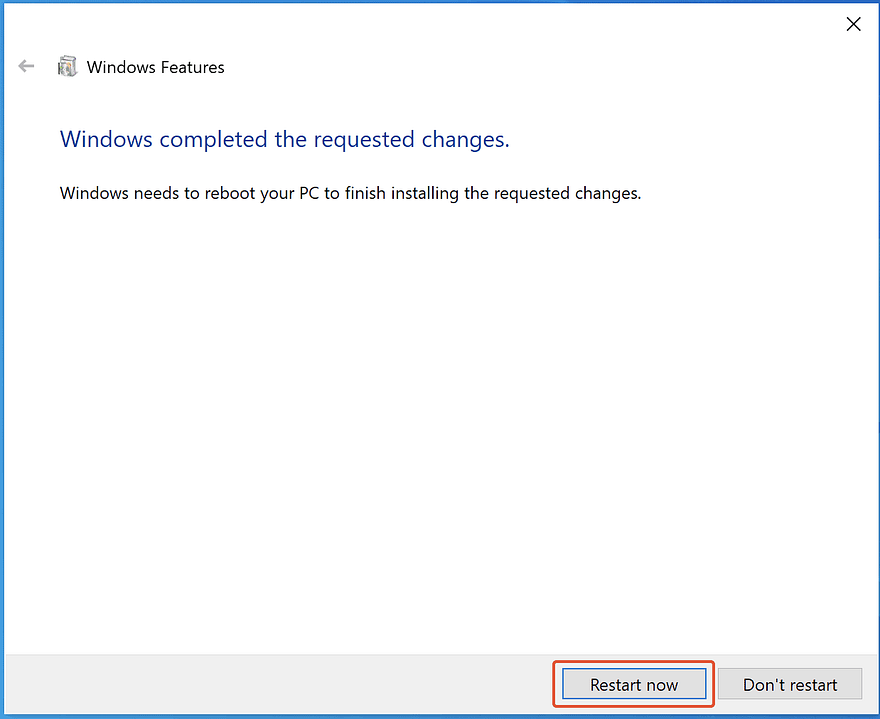
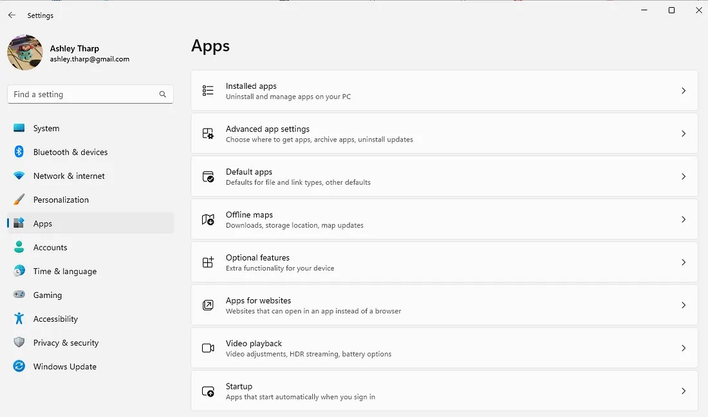

## Class Notes Table of Contents

-   [Course Overview](README.md)
-   [Tool Setup](1_DU_tool_setup.md)
-   [Tool Setup Mac](1.1_DU_tool_setup_mac.md)
-   [Tool Setup Windows](1.2_DU_tool_setup_windows.md)
-   [Tool Setup Windows - alternate setup](1.2.1_DU_tool_setup_windows_WSL.md)
-   [Online Research Tips](2_Online_Research_Tips.md)
-   [Further Reading and Helpful Links](3_Further_Reading_and_Helpful_Links.md)
-   [Articles & Subscriptions](4_Articles_and_subscriptions.md)
-   [Career Engagement](6_Useful_Python.md)

----------------------------------------------

# DU AI Bootcamp Advanced Windows Tools Setup

-   [Back to tool setup](1_DU_tool_setup.md)
-   [Standard Windows setup](1.2_DU_tool_setup_windows.md)

## Standard Setup

These instructions are from the Pre-work module and the orientation module of the DU AI Bootcamp course

## **Not supported** ***alternate*** setup with WSL

## 0. Install Windows Terminal

See Reference: *[Install and get started setting up Windows Terminal](https://learn.microsoft.com/en-us/windows/terminal/install)*

**Why Windows Terminal:**  [Windows Terminal](https://learn.microsoft.com/en-us/windows/terminal/) is a modern host application for the command-line shells you already love, like Command Prompt, PowerShell, and bash (via Windows Subsystem for Linux (WSL)). Its main features include multiple tabs, panes, Unicode and UTF-8 character support, a GPU accelerated text rendering engine, and the ability to create your own themes and customize text, colors, backgrounds, and shortcuts.

0.1 Download & Install Windows Terminal
- [Download windows Terminal](https://aka.ms/terminal)
- Follow the install wizard instructions

0.2 Learn More about Windows Terminal
- [What is Windows Terminal?](https://learn.microsoft.com/en-us/windows/terminal/)
- [Install and get started setting up Windows Terminal](https://learn.microsoft.com/en-us/windows/terminal/install)

## 1. Setup WSL
See Reference: *[Step by Step Procedure to Install WSL2 on Windows And Run Ubuntu on Windows Using WSL2](https://www.linkedin.com/pulse/step-procedure-install-wsl2-windows-run-ubuntu-using-arun-kl/)*

### 1.1 Enable WSL in windows features

#### 1.1.1 Open ‘Turn Windows features on or off’ on your Windows Computer
   - Click on ‘Start‘, search for ‘Turn Windows features on or off‘ –> Open.

#### 1.1.2 Enable ‘Virtual Machine Platform‘ and ‘Windows Subsystems for Linux‘ features
- Enable ‘Virtual Machine Platform‘ and ‘Windows Subsystems for Linux‘ features by enabling check mark and click on **‘OK‘**.
    - note: Microsoft only says to enable ***Windows Substytem for linux*** while most other guides also enable ***Virtual Machine Platform***

#### 1.1.3 Restart your computer

### 1.2 Install WSL2

#### 1.2.1 Update Linux Kernal

-   Download Linux Kernel Updates Package from this Microsoft [Link](https://wslstorestorage.blob.core.windows.net/wslblob/wsl_update_x64.msi) and Install with Administrative Privileges.
-   Run the downloaded Setup file. Click ‘Next‘ to start the installation and ‘Finish‘ after successful installation.

### 1.3 Install Linux OS
See Reference: *[How to install Linux on Windows with WSL](https://learn.microsoft.com/en-us/windows/wsl/install)*

#### 1.3.1 Install Default Version
This command will install the default version of ubuntu into WSL

`wsl --install`

#### 1.3.2 *Alternate* Pick from a distro
Note:  This method may also be used to install an additional distribution.  You may then switch between distributions.

-   list available distributions:  
`wsl -l -o` or `wsl --list --online`
-   install specific distributions:  
`wsl --install -d <Distribution Name>`

#### 1.3.3 Other WSL distribution related commands.

-   To set the default Linux distribution used with the wsl command, enter: `wsl -s <DistributionName>` or `wsl --set-default <DistributionName>`
-   To run a specific wsl distribution from within PowerShell or Windows Command Prompt without changing your default distribution, use the command: `wsl -d <DistributionName>`
-   To permanently delete/remove a distribution see section 1.5

### 1.4 Verify Install
- Start the distro:
    - from Terminal run `wsl` or `wsl -d <Distribution Name>`
- check the version of the kernal:
    - `uname -srm`
- check the version of linux:
    - `cat /etc/os-release`
    or
    - `hostnamectl`

### 1.5 For reference:  How to uninstall / delete a WSL distro
See Reference: *[How to Uninstall a WSL distro on Windows 11](https://medium.com/web3-use-case/how-to-uninstall-a-wsl-distro-on-windows-11-dfcc2d26e902#:~:text=To%20completely%20remove%20a%20Linux,Click%20on%20Apps.&text=Select%20the%20Linux%20distro%2C%20open,choose%20the%20%E2%80%9CUninstall%E2%80%9D%20option.)*

#### 1.5.1 Select Windows - *Settings->Apps->Installed Apps*

 Installed apps" width="300">

#### 1.5.2 Uninstall the Distro to be deleted
-   Select the Linux distro, open the menu (three-dotted button) on the right side, and choose the “Uninstall” option.

#### 1.5.3 Complete the uninstall in WSL
-   Run `wsl -l`
-   Note the distro is still listed
-   Remove a distribution from WSL and delete all of the data associated with that Linux distribution, run `wsl --unregister <distroName>`
-   Now run `wsl -l`
-   **Note:** the distribution has been removed from WSL

### References used for the alternate setup
-   [Step by Step Procedure to Install WSL2 on Windows And Run Ubuntu on Windows Using WSL2](https://www.linkedin.com/pulse/step-procedure-install-wsl2-windows-run-ubuntu-using-arun-kl/)
-   [How to install Linux on Windows with WSL](https://learn.microsoft.com/en-us/windows/wsl/install)
-   [Install and get started setting up Windows Terminal](https://learn.microsoft.com/en-us/windows/terminal/install)
-   [Get started using Visual Studio Code with Windows Subsystem for Linux](https://learn.microsoft.com/en-us/windows/wsl/tutorials/wsl-vscode)
-   [Integrated Terminal in Visual Studio Code](https://code.visualstudio.com/docs/terminal/basics)
-   [Conda - Activating an environment](https://conda.io/projects/conda/en/latest/user-guide/tasks/manage-environments.html#activating-an-environment)
-   [Python environments in VS Code](https://code.visualstudio.com/docs/python/environments)
-   [Work in WSL with Visual Studio Code- Remote development in WSL](https://code.visualstudio.com/docs/remote/wsl-tutorial)
