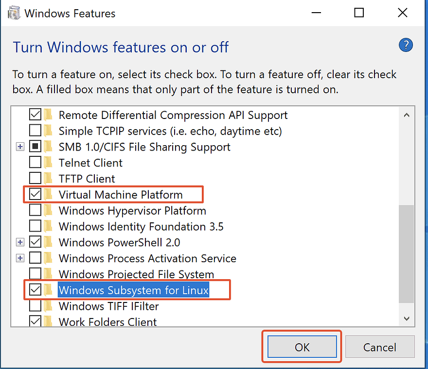
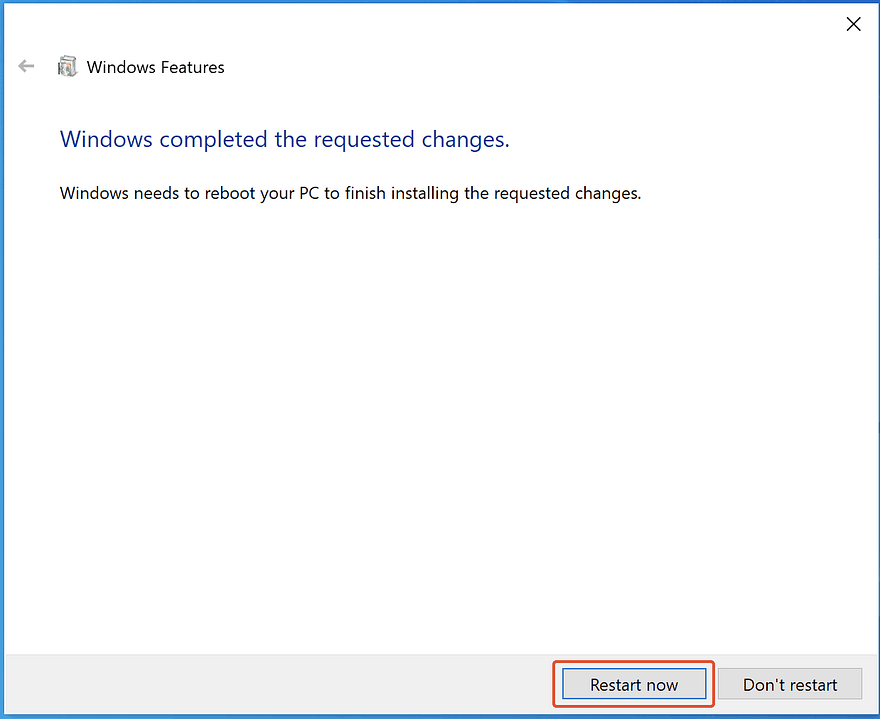
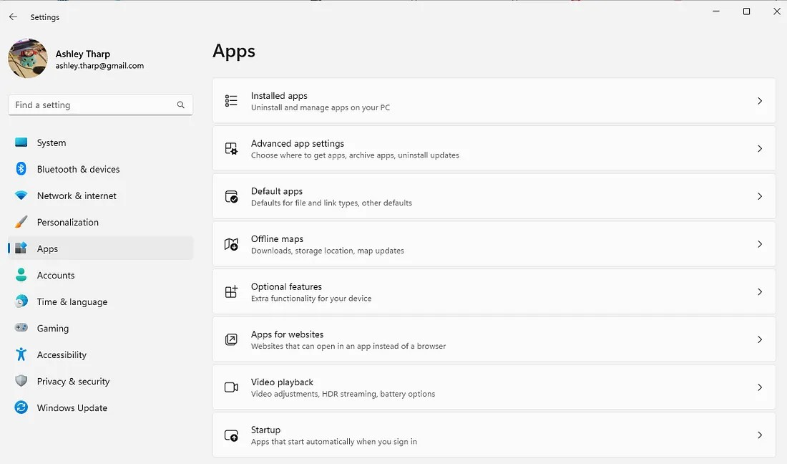
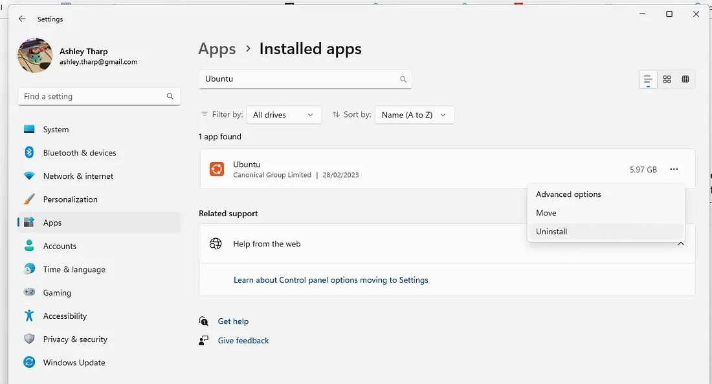
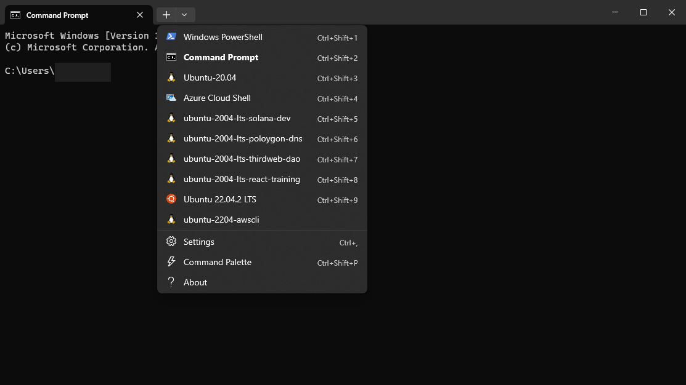

# DU AI Bootcamp Advanced Windows Setup - WSL


### DU Class Notes Table of Contents

----------------------------------------------

-   [Course Overview](README.md)
-   [Tool Setup](1_DU_tool_setup.md)
    -   [Tool Setup - Mac](1.1_DU_tool_setup_mac.md)
    -   [Tool Setup - Windows](1.2_DU_tool_setup_windows.md)
        -   [Windows - alternate setup using wsl](1.2.1_DU_windows_alternate_install_using_wsl.md)
        -   [Tool Setup - Windows WSL](1.2.2_DU_tool_setup_wsl.md)
-   [Online Research Tips](2_online_research_tips.md)
-   [Further Reading and Helpful Links](3_further_reading_and_helpful_links.md)
    -   [Cheatsheets & Tips](3.1_cheatsheets_and_tips.md)
        -   [Scientific python cheatsheet by IPGD](3.1.1_scientific_python_cheat_sheet_by_IPGP.md)
        -   [Useful Python tips](3.1.2_useful_python.md)
    -   [Books](3.2_books.md)
    -   [Articles](3.3_articles.md)
    -   [Subscriptions](3.4_subscriptions)
-   [Career Engagement](4_career_engagement.md)

----------------------------------------------


## Standard Setup

These instructions are from the Pre-work module and the orientation module of the DU AI Bootcamp course


## **Not supported** ***alternate*** setup with WSL


## 0. Install Windows Terminal

See Reference: *[Install and get started setting up Windows Terminal](https://learn.microsoft.com/en-us/windows/terminal/install)*

**Why Windows Terminal:**  [Windows Terminal](https://learn.microsoft.com/en-us/windows/terminal/) is a modern host application for the command-line shells you already love, like Command Prompt, PowerShell, and bash (via Windows Subsystem for Linux (WSL)). Its main features include multiple tabs, panes, Unicode and UTF-8 character support, a GPU accelerated text rendering engine, and the ability to create your own themes and customize text, colors, backgrounds, and shortcuts.

0.1 Download & Install Windows Terminal
- [Download windows Terminal](https://aka.ms/terminal)
- Follow the install wizard instructions

0.2 Learn More about Windows Terminal
- [What is Windows Terminal?](https://learn.microsoft.com/en-us/windows/terminal/)
- [Install and get started setting up Windows Terminal](https://learn.microsoft.com/en-us/windows/terminal/install)


## 1. Setup WSL
See Reference: *[Step by Step Procedure to Install WSL2 on Windows And Run Ubuntu on Windows Using WSL2](https://www.linkedin.com/pulse/step-procedure-install-wsl2-windows-run-ubuntu-using-arun-kl/)*

### 1.1 Enable WSL in windows features

#### 1.1.1 Open ‘Turn Windows features on or off’ on your Windows Computer
   - Click on ‘Start‘, search for ‘Turn Windows features on or off‘ –> Open.

<center></center>

#### 1.1.2 Enable ‘Virtual Machine Platform‘ and ‘Windows Subsystems for Linux‘ features
- Enable ‘Virtual Machine Platform‘ and ‘Windows Subsystems for Linux‘ features by enabling check mark and click on **‘OK‘**.
    - note: Microsoft only says to enable ***Windows Substytem for linux*** while most other guides also enable ***Virtual Machine Platform***

<center></center>

#### 1.1.3 Restart your computer
<center></center>

### 1.2 Install WSL2

#### 1.2.1 Update Linux Kernal

-   Download Linux Kernel Updates Package from this Microsoft [Link](https://wslstorestorage.blob.core.windows.net/wslblob/wsl_update_x64.msi) and Install with Administrative Privileges.
-   Run the downloaded Setup file. Click ‘Next‘ to start the installation and ‘Finish‘ after successful installation.
<center></center>

### 1.3 Install Linux OS
See Reference: *[How to install Linux on Windows with WSL](https://learn.microsoft.com/en-us/windows/wsl/install)*

#### 1.3.1 Install Default Version
This command will install the default version of ubuntu into WSL

`wsl --install`

#### 1.3.2 *Alternate* Pick from a distro
Note:  This method may also be used to install an additional distribution.  You may then switch between distributions.

-   list available distributions:  
`wsl -l -o` or `wsl --list --online`
-   install specific distributions:  
`wsl --install -d <Distribution Name>`

#### 1.3.3 Other WSL distribution related commands.

-   To set the default Linux distribution used with the wsl command, enter: `wsl -s <DistributionName>` or `wsl --set-default <DistributionName>`
-   To run a specific wsl distribution from within PowerShell or Windows Command Prompt without changing your default distribution, use the command: `wsl -d <DistributionName>`
-   To permanently delete/remove a distribution see section 1.5

### 1.4 Verify Install
- Start the distro:
    - from Terminal run `wsl` or `wsl -d <Distribution Name>`
- check the version of the kernal:
    - `uname -srm`
- check the version of linux:
    - `cat /etc/os-release`
    or
    - `hostnamectl`


### 1.5 For reference:  How to uninstall / delete a WSL distro
See Reference: *[How to Uninstall a WSL distro on Windows 11](https://medium.com/web3-use-case/how-to-uninstall-a-wsl-distro-on-windows-11-dfcc2d26e902#:~:text=To%20completely%20remove%20a%20Linux,Click%20on%20Apps.&text=Select%20the%20Linux%20distro%2C%20open,choose%20the%20%E2%80%9CUninstall%E2%80%9D%20option.)*

#### 1.5.1 Select Windows - *Settings->Apps->Installed Apps*
<center> Installed apps" width="300"></center>

#### 1.5.2 Uninstall the Distro to be deleted
-   Select the Linux distro, open the menu (three-dotted button) on the right side, and choose the “Uninstall” option.
<center></center>

#### 1.5.3 Complete the uninstall in WSL
-   Run `wsl -l`
-   Note the distro is still listed
-   Remove a distribution from WSL and delete all of the data associated with that Linux distribution, run `wsl --unregister <distroName>`
-   Now run `wsl -l`
-   **Note:** the distribution has been removed from WSL

### References used for the alternate setup
-   [Step by Step Procedure to Install WSL2 on Windows And Run Ubuntu on Windows Using WSL2](https://www.linkedin.com/pulse/step-procedure-install-wsl2-windows-run-ubuntu-using-arun-kl/)
-   [How to install Linux on Windows with WSL](https://learn.microsoft.com/en-us/windows/wsl/install)
-   [Install and get started setting up Windows Terminal](https://learn.microsoft.com/en-us/windows/terminal/install)
-   [Get started using Visual Studio Code with Windows Subsystem for Linux](https://learn.microsoft.com/en-us/windows/wsl/tutorials/wsl-vscode)
-   [Integrated Terminal in Visual Studio Code](https://code.visualstudio.com/docs/terminal/basics)
-   [Conda - Activating an environment](https://conda.io/projects/conda/en/latest/user-guide/tasks/manage-environments.html#activating-an-environment)
-   [Python environments in VS Code](https://code.visualstudio.com/docs/python/environments)
-   [Work in WSL with Visual Studio Code- Remote development in WSL](https://code.visualstudio.com/docs/remote/wsl-tutorial)

# Installing multiple WSL instances

**Note:** Not needed for DU AI Class.  However, this approach may make is easier to reset to a clean instance or install alternate instances for other purposes.

Source: [How to install multiple wsl instances](https://wpclouddeploy.com/how-to-use-multiple-wsl-instances-for-development/)

1. Prepare File System

    You need to create a folder that will hold all the different instances. For the purposes of this article lets call that folder c:\wsl

    Under that folder you should create one for exports – c:\mywsl\exports and one for c:\mywsl\instances.

    The folder c:\mywsl\exports will contain exports of instances or Linux images. When this article is complete it will have at least one image (two if you currently have WSL installed.)

    The folder c:\mywsl\instances will contain the file system for the current live instances.

2.  Export your WSL instance

    If you have WSL installed and have been using it for a while, we need to reset it so you have a clean base to start from. But you probably want to save your current instance.

    First, lets get the name of your current instances. Open a WINDOWS COMMAND prompt (not a Linux prompt) and type this:

    ```
    wsl --list
    ```

    You might see a single instance listed such as ‘Ubuntu-22.04’ or ‘Ubuntu-20.04’. This is the name we’ll use for the next set of commands.

    Lets export a copy of the current instance to c:\mywsl\exports. If your instance is named **Ubuntu-22.04**:

    ```
    wsl --export Ubuntu-22.04 c:\mywsl\exports\wsl-original-instance
    ```
    Your current WSL data will be snapshotted to the c:\mywsl\exports\wsl-original-instance file.


3. Delete Your Current WSL Instance

    If you have WSL installed and have completed step 2 above, it’s time to delete it. Assuming the instance is named Ubuntu-22.04:

    ```
    wsl --unregister Ubuntu-22.04
    ```

4. Install a Clean WSL Instance

    To install a new clean instance of Ubuntu 22.04, use the command command:

    ```
    wsl --install Ubuntu-22.04
    ```

    You can replace ‘Ubuntu-22.04’ with any other version of Linux. To see possible versions, run:

    ```
    wsl --list --online
    ```

    When you attempt to log in to the new WSL instance. you will be asked to setup a user name and password.

    Once you are logged in, you should run the following two commands at the Linux prompt:

    ```
    sudo apt-get update -y
    sudo apt-get upgrade -y
    ```

    This will make sure your instance has the latest OS updates.


5. Export Your New Clean Instance

    At this point you have a clean instance that you can save and use as a starting point for any project. So lets export it:

    ```
    wsl --export Ubuntu-22.04  c:\mywsl\exports\wsl-clean-instance-ubuntu2204
    ```

    This assumes that your new instance name is ‘Ubuntu-22.04’ and that you’re saving the exported instance data to c:\mywsl\exports\wsl-clean-instance-ubuntu2204


6. Create A New Development Instance

    Lets create a couple of new WSL instances called PROJECT01 and PROJECT02 so you can see how this is done.

    To create a PROJECT01 instance:

    ```
    wsl --import project01 c:\mywsl\instances\project01 c:\mywsl\exports\wsl-clean-instance-ubuntu2204
    ```

    This command imports the clean instance you exported in step 5 and gives it the name ‘project01’. It stores the data for the new running instance in the c:\mywsl\instances\project01 folder.

    Repeat to create the PROJECT02 instance:

    ```
    wsl --import project02 c:\mywsl\instances\project02 c:\mywsl\exports\wsl-clean-instance-ubuntu2204
    ```

    At this point you should have TWO running instances plus your original instance for a total of three instances.

    Alternates:

    ```
    # duaiml
    wsl --import ubuntu-22.04-du-aiml c:\mywsl\instances\duaiml c:\mywsl\exports\wsl-clean-instance-ubuntu2204

    # trading
    wsl --import ubuntu-22.04-trading c:\mywsl\instances\trading c:\mywsl\exports\wsl-clean-instance-ubuntu2204

    # general
    wsl --import ubuntu-22.04-general c:\mywsl\instances\general c:\mywsl\exports\wsl-clean-instance-ubuntu2204

    # original-aiml
    wsl --import ubuntu-22.04-original-aiml c:\mywsl\instances\original c:\mywsl\exports\wsl-original-instance

    ```

    To run a specific distribution:

    ```
    # Run distro
    wsl wsl --distribution <Distribution Name>

    # Run distro as given user
    wsl --distribution <Distribution Name> --user <User Name>
    ```

7. Login To An Instance

    So, the question on your mind is probably something along the lines of how to access each instance.

    To do that, you MUST launch a new instance of Windows Terminal – if you try to use an existing Windows Terminal instance you will not be able to login to the new WSL instances. You’ll find your instances located as shown in the image below:

    

    Each instance you choose will be opened in a separate tab.

    Using the examples in this article, you would open both PROJECT01 and PROJECT02, they would appear in separate tabs and you can start installing different packages and configuration into each.

8. Linking To Visual Studio Code

    In each tab, you can run the following to open up a linked instance of VS Code:

    code .
    Notice the period at the end of the command – this tells VS CODE to open and link to the current folder.

**Tips**:

The technique in step 5 and 6 above can be used to export an instance at any point in time and use that as the starting point for new WSL instances.

For example, you can create a WSL instance with PHP, COMPOSER etc. pre-installed and export that as a saved instance. Then, when it’s time to start a new PHP project, simply import that saved instance as a new live WSL instance and you’re ready to go!

**Notes**

- This method of development requires a lot more diskspace of course since you’ll have a WSL instance for each project.
- If you run a lot of projects simultaneously, keeping all the instances up to date might become a PITA.
- When installing WLS instances we recommend using the latest long term versions (eg: Ubuntu 22.04 instead of Ubuntu 23.x).

**References**

Basic WSL Commands: https://learn.microsoft.com/en-us/windows/wsl/basic-commands

How To Install WSL: https://learn.microsoft.com/en-us/windows/wsl/install