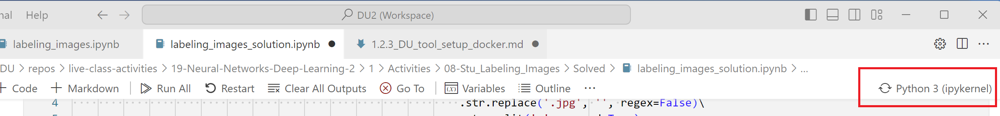
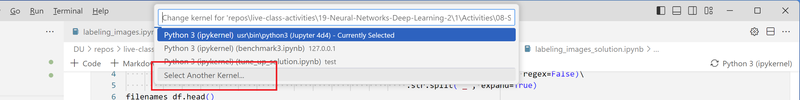
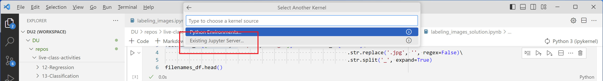
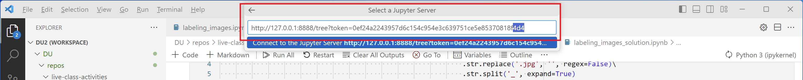
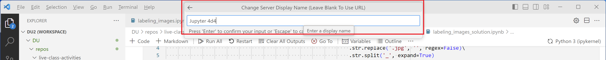

# DU AI Bootcamp Windows WSL Tool Setup

### DU Class Notes Table of Contents

----------------------------------------------

-   [Course Overview](README.md)
-   [Tool Setup](1_DU_tool_setup.md)
    -   [Tool Setup - Mac](1.1_DU_tool_setup_mac.md)
    -   [Tool Setup - Windows](1.2_DU_tool_setup_windows.md)
        -   [Windows - alternate setup using wsl](1.2.1_DU_windows_alternate_install_using_wsl.md)
        -   [Tool Setup - Windows WSL](1.2.2_DU_tool_setup_wsl.md)
        -   [Window - alternative setup using docker](1.2.3_DU_tool_setup_docker.md)

-   [Online Research Tips](2_online_research_tips.md)
-   [Further Reading and Helpful Links](3_further_reading_and_helpful_links.md)
    -   [Cheatsheets & Tips](3.1_cheatsheets_and_tips.md)
        -   [Scientific python cheatsheet by IPGD](3.1.1_scientific_python_cheat_sheet_by_IPGP.md)
        -   [Useful Python tips](3.1.2_useful_python.md)
    -   [Books](3.2_books.md)
    -   [Articles](3.3_articles.md)
    -   [Subscriptions](3.4_subscriptions)
-   [Career Engagement](4_career_engagement.md)

----------------------------------------------
# What is a container management tool (ref: claude.ai)

A container management tool is software that helps create, deploy, run, and oversee containers. Containers are lightweight, standalone packages that include everything needed to run a piece of software, including the code, runtime, system tools, libraries, and settings.

Key functions of container management tools include:

- Creating containers: Building container images from specifications.
- Running containers: Starting, stopping, and restarting containers.
- Networking: Managing how containers communicate with each other and the outside world.
- Storage: Handling data persistence and sharing between containers and the host system.
- Orchestration: Coordinating multiple containers, especially in complex applications.
- Monitoring: Tracking container health, resource usage, and performance.
- Scaling: Adjusting the number of container instances based on demand.
- Security: Implementing isolation and access controls.

These tools are crucial in modern software development and deployment, especially in microservices architectures and cloud environments. They help streamline development processes, improve resource utilization, and enhance application portability.

# Step 1: Install & Configure a Container Management Tool

Docker and Podman are both container management tools, but they have some key differences:

**Docker:**

Pioneered the modern container ecosystem
Uses a client-server architecture with a central daemon
Requires root privileges by default
Widely adopted and has a large ecosystem

**Podman:**

Daemonless architecture, runs containers in user space
Doesn't require root privileges by default
Compatible with Docker commands and images
Focuses on security and rootless containers

Both tools allow you to build, run, and manage containers, which are lightweight, portable environments for applications.

**Note** I have not found a method to properly connect podman and vscode.  With podman, you will have to run notebooks with the Jupyter web interface.

## Step 1 option A: Install & Configure `Podman`

1. Install WSL2 (Follow windows instructions)
2. Install Podman (windows installer: https://podman.io/docs/installation)
3. Install Podman Desktop (windows installer: https://podman-desktop.io/docs/installation)
4. Install CUDA support in Podman (**DO THIS STEP IF YOU WISH TO USE YOUR GPU FOR CALCULATIONS**)
    1. Follow these instructions from rootfs:  
       1. https://github.com/containers/podman/issues/19005 
       2. Also see: https://docs.nvidia.com/datacenter/cloud-native/container-toolkit/latest/install-guide.html
    2. Open windows terminal in podman vm in WSL2 (podman_machine_default)

        ```
        curl -s -L https://nvidia.github.io/libnvidia-container/stable/rpm/nvidia-container-toolkit.repo | sudo tee /etc/yum.repos.d/nvidia-container-toolkit.repo
        
        sudo yum install -y nvidia-container-toolkit
        
        sudo nvidia-ctk runtime configure --runtime=docker
        
        nvidia-ctk cdi list`
        ```

    3. Test

        ```
        podman run --device nvidia.com/gpu=all nvcr.io/nvidia/k8s/cuda-sample:nbody nbody -benchmark -gpu
        ```


## Step 1 option B: Install & Configure `Docker`

1. Install WSL2 (Follow windows instructions)
2. Install Docker Desktop (windows installer: https://docs.docker.com/desktop/wsl/)
3. Install CUDA support in Docker (**DO THIS STEP IF YOU WISH TO USE YOUR GPU FOR CALCULATIONS**)
   1. CUDA GPU Support is provided by default in Docker Desktop for windows using WSL2:  
      - See: https://docs.docker.com/desktop/gpu/
      - https://docs.nvidia.com/datacenter/cloud-native/container-toolkit/latest/install-guide.html

   2. Test

        ```
        docker run --rm -it --gpus=all nvcr.io/nvidia/k8s/cuda-sample:nbody nbody -gpu -benchmark
        ```

# Step 2: Pull a container:
Pull container from either location:  (https://docs.podman.io/en/v4.4/markdown/podman-run.1.html)
1. https://hub.docker.com/r/tensorflow/tensorflow/
    - Tags: https://hub.docker.com/r/tensorflow/tensorflow/tags/  (latest-gpu-jupyter)
    - Source Dockerfiles:  https://github.com/tensorflow/tensorflow/tree/master/tensorflow/tools/tf_sig_build_dockerfiles
    - image `tensorflow/tensorflow:latest-gpu-jupyter`
   -  example `docker pull tensorflow/tensorflow:latest-gpu-jupyter`
   -  example `podman pull tensorflow/tensorflow:latest-gpu-jupyter`
2. https://jupyter-docker-stacks.readthedocs.io/en/latest/using/selecting.html
    - https://quay.io/jupyter/tensorflow-notebook:cuda-latest

    example `docker pull quay.io/jupyter/tensorflow-notebook:cuda-latest`
    example `podman pull quay.io/jupyter/tensorflow-notebook:cuda-latest`
        
# Step 3: Start the container

Note: Flags used

- Note: Flags used

  - `-d`, `--detach`: Run container in background and print container ID
  - `-i`, `--interactive`:  Keep STDIN open even if not attached
  - `-t`, `--tty`:  Allocate a pseudo-TTY
  - `-v`, `--volume`:  Bind mount a volume
  - `--gpus`:  API 1.40+ GPU devices to add to the container ('all' to pass all GPUs)
  - `--rm`:  Automatically remove the container when it exits
  - `-p`, `--publish`: Publish a container's port(s) to the host

- **Podman Example**: Given:  Local directory   `C:\ML\DU\repos`.  Default working directory `jovyan`:

    - Container for Jupyter Stacks (contains pandas, etc)

        `podman run --gpus all -it --rm -d -v C:/ML/DU/repos:/home/jovyan/work  -p 8888:8888 quay.io/jupyter/tensorflow-notebook:cuda-latest`

    - Container from tensorflow

        `podman run --gpus all -it --rm -d -v C:/ML/DU/repos:/tf  -p 8888:8888 tensorflow/tensorflow:latest-gpu-jupyter`


- **Docker Example**:  Give: Local directory `C:\ML\DU\repos`.  Default working direcotry `/tf`

    - Container for Jupyter Stacks (contains pandas, etc)

        `docker run --gpus all -it --rm -d -v C:/ML/DU/repos:/home/jovyan/work  -p 8888:8888 quay.io/jupyter/tensorflow-notebook:cuda-latest`

    - Container from tensorflow
      - **Note:  The tensorflow container does not have most data science libraries (pandas, numpy, scipy, etc).**  Therefore, once it is started, open the container in `docker desktop`.  Go to the `exec` tab.  Then enter `pip install -r /path/to/requirements.txt`  A requirements.txt file with most packages needed is included here [requirements.txt](files/requirements.txt)

        `docker run --gpus all -it --rm -d -v C:/ML/DU/repos:/tf  -p 8888:8888 tensorflow/tensorflow:latest-gpu-jupyter`

- **NOTES** Podman run parameters
    - `--volume`, `-v`=[[SOURCE-VOLUME|HOST-DIR:]CONTAINER-DIR[:OPTIONS]]
    - `--tty, -t : Allocate a pseudo-TTY. The default is false.
    - `--interactive`, `-I` : When set to true, keep stdin open even if not attached. The default is false.
    - `--rm` : Automatically remove the container when it exits. The default is false.
    - `--workdir`, `-w`:  Working directory inside the container

# Step 4: Running 

- Open a notebook and click on the kernel selector (or open the Command Palette `(Cntrl+Shift+P)` then select `Notebook: Select Notebook Kernel`
- Select `Select Another Kernel`
- Select `Jupyter Server from Docker Containers`
- Select a container image for your project (currently, the Scientific Python Stack is supported)
- Select the kernel from the container image (e.g., Python 3)

# Step 5A:  Attach Windows VSCode to Podman container

Podman does not seem to have a good path to connect to vscode.  Connecting to Docker can provide inconsistent results.  **So this section needs more research and work.**

**Docker**
# Step 5B:  Attach Windows VSCode to jupyter in Docker container

1. Get the jupyter URL from the docker startup logs in terminal

    Note:  When your docker container starts, it lists a URL with a token.  

    Example: 

    `http://127.0.0.1:8888/tree?token=0ef24a2243957d6c154c954e3c639751ce5e85370818f4d4`

2. In VSCode: 

- click on `select kernel`

    

- click on `select another kernel`



- click on `Existing Jupyter Server`



- Enter/Paste the `Jupyter URL` including the token copied from the terminal startup information in terminal (or from the logs of the container in docker desktop)



- Enter a `Server Display Name`.  I use "Jupyter" plus the last three characters of the token in the jupyter URL.



# Notes: Running Containers (different container versions)

## Start a CPU-only container

```
$ docker run -it --rm tensorflow/tensorflow bash
```
___

## Start a GPU container, using the Python interpreter.
```
$ docker run -it --rm --runtime=nvidia tensorflow/tensorflow:latest-gpu python
```

___
## Run a Jupyter notebook server with your own notebook directory:

Own notebook directory assumed here to be `~/notebooks`. To use it, navigate to `localhost:8888` in your browser.

```
$ docker run -it --rm -v $(realpath ~/notebooks):/tf/notebooks -p 8888:8888 tensorflow/tensorflow:latest-jupyter
```

# Other references:


**Podman & VSCode References**
- https://medium.com/@FredAsDev/connect-vs-code-jupyter-notebook-to-a-jupyter-container-a63293f29325
- https://stackoverflow.com/questions/77167514/how-to-attach-visual-studio-code-terminal-to-a-podman-container
- https://docs.podman.io/en/latest/markdown/podman-system-service.1.html
- https://stackoverflow.com/questions/77167514/how-to-attach-visual-studio-code-terminal-to-a-podman-container

**Tensorflow repos**

- https://github.com/orgs/tensorflow/repositories?type=all
- https://hub.docker.com/r/tensorflow/tensorflow/
- https://hub.docker.com/r/tensorflow/build
- https://hub.docker.com/layers/tensorflow/tensorflow/latest-gpu-jupyter/images/sha256-efc25f8ad0ec337e8f4e2de9e7e8e391e6729481c7a7cae4bdea3137da7822c6?context=explore

**Other install instructions:**

- https://www.tensorflow.org/install/docker
- https://docs.docker.com/reference/cli/docker/container/run/#volume
- https://discussion.fedoraproject.org/t/how-to-run-tensorflow-gpu-in-podman/74060
- https://github.com/containers/podman/issues/19005
- https://phoenixnap.com/kb/podman-vs-docker#:~:text=The%20Docker's%20architecture%20requires%20the,do%20not%20require%20superuser%20privileges.
- https://phoenixnap.com/blog/what-is-container-orchestration
    
