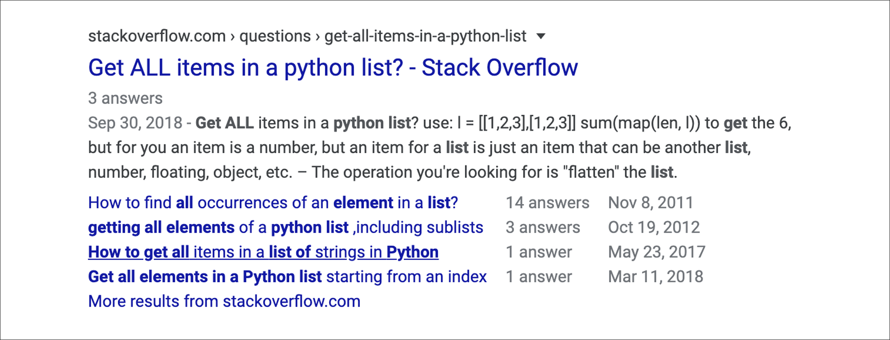

# Online Research Tips

### DU Class Notes Table of Contents

----------------------------------------------

-   [Course Overview](README.md)
-   [Tool Setup](1_DU_tool_setup.md)
    -   [Tool Setup - Mac](1.1_DU_tool_setup_mac.md)
    -   [Tool Setup - Windows](1.2_DU_tool_setup_windows.md)
        -   [Windows - alternate setup using wsl](1.2.1_DU_windows_alternate_install_using_wsl.md)
        -   [Tool Setup - Windows WSL](1.2.2_DU_tool_setup_wsl.md)
-   [Online Research Tips](2_online_research_tips.md)
-   [Further Reading and Helpful Links](3_further_reading_and_helpful_links.md)
    -   [Cheatsheets & Tips](3.1_cheatsheets_and_tips.md)
        -   [Scientific python cheatsheet by IPGD](3.1.1_scientific_python_cheat_sheet_by_IPGP.md)
        -   [Useful Python tips](3.1.2_useful_python.md)
    -   [Books](3.2_books.md)
    -   [Articles](3.3_articles.md)
    -   [Subscriptions](3.4_subscriptions)
-   [Career Engagement](4_career_engagement.md)

----------------------------------------------

---
AI development often entails curating bits and pieces of information from documentation, online forums, and websites. It also requires an ability to quickly research solutions to problems you are working on. The tools you'll use and the field as a whole are constantly changing. As you will soon find, search engines are invaluable tools for conducting research.

**Search engine research** is using search engines (especially Google) to quickly find useful information on the internet.

Here are a few tips for improving your research skills:

-   **Use search category tabs.** For example, if you’re searching for images, click on the Image tab; if you’re looking for news articles, click on the News tab. On Google, there’s even a Google Scholar tab (which is sometimes hidden) that you can use to search for scholarly resources like academic papers and journals.
    
    
    
-   **Use quotes.** Putting a phrase in quotes will tell Google you want those words in that specific order. For example, if you search for "python best practices," you’ll probably get a lot of results about best practices for Python. But, if you’re searching for a blog post that says "python best practices" in the title, searching for _“python best practices”_ (in quotes) will likely put that blog post higher up in the list of search results.
    
    
    
-   **Use the minus sign.** Put a minus sign before words or phrases (in quotes) that you don’t want to search for. For example, if you’re searching for information about pythons and getting a lot of information about programming, you could put python -programming to ignore any pages about programming.
    
    
    
-   **Use the site specificer.** For example, if you’re looking for an article on the New York Times website, you can add _site.com_ to your search. This will return only search results from nytimes.com.
    
    
    

In this course, you will learn a variety of coding languages that each have their own syntax and format. Learning how to write code can be frustrating. If you get stuck, remember that you can usually get help by searching online.

For more online search tips, check out this [article Links to an external site.](http://www.informit.com/articles/article.aspx?p=1315437).

Here are some final takeaways:

-   Use simple, but exact, phrases to ensure you get a sufficient number of search results that are also relevant to what you're looking for. You can always refine your search as you go.
-   Consult [Stack Overflow Links to an external site.](https://stackoverflow.com/). This will be your number-one, go-to source to find answers from other developers, but make sure to use it properly. More on this in the next section.
-   Don't simply copy and paste code that you find online, as this can lead to errors. Instead, **refactor** it—that is, restructure the code so that it performs more efficiently, but without changing what it does. A good rule of thumb is to use code you find as a resource, not a solution.

## Researching Code Solutions

Just like search engine research, it's important to know how to use Stack Overflow when you're looking for a solution for your code. For example, let's say you searched for "how to get all the elements in a Python list." The Stack Overflow results might look something like this:

The results from this search returns many options with the question, the number of answers, and the date the question was posted. Which one do you choose? Each question is user-specific and may not be a solution you need. The best approach here is select one or two of the more recent options, read the question, and look at the posted answers.

Often, you’ll find what you need and learn some new tricks along the way. However, if you can’t find a solution that works, you may have to continue your search by selecting one of the suggested search options at the bottom of the page.

Remember to break down your search terms into more general phrases; don’t search for the exact solution you need. Simplifying it into general terms will yield more helpful results.

## Using Xpert Learning Assistant

The Xpert Learning Assistant is your go-to guide throughout your boot camp experience. Accessible via your course navigation, this AI Learning Assistant offers instant answers, quizzes on coding concepts, and invaluable assistance, ensuring you're equipped and prepared for every step of your coding journey.

### Best practices

The Xpert Learning Assistant provides you with additional research options while working on activities or assignments. Here are some best practices to follow:

-   When asking about an assignment, be specific about what you’re building and the desired outcome.
    
-   When asking about code, be sure to have your code and repo ready to share with Xpert to ensure the most accurate answer
    
-   When asking about error codes, be sure to include the tools you’re using (Heroku, SQL, etc) and have the error code ready to share.
    
    **note**
    
    Be sure to share specific error language, not entire error log files.
